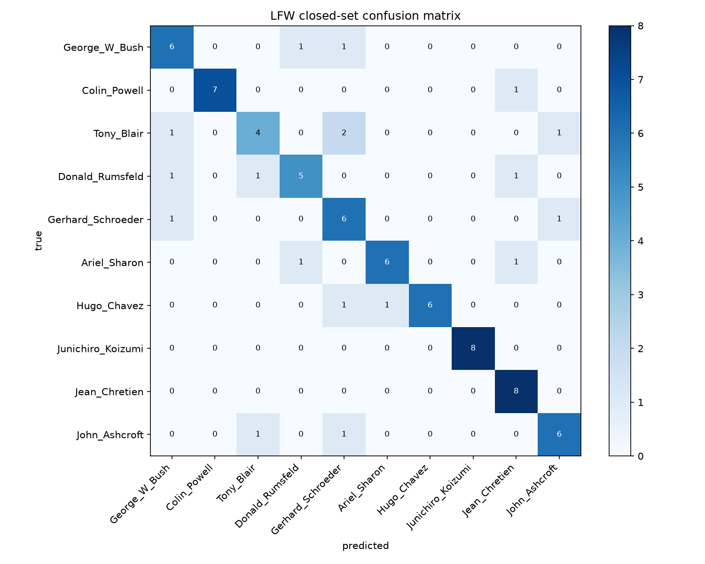
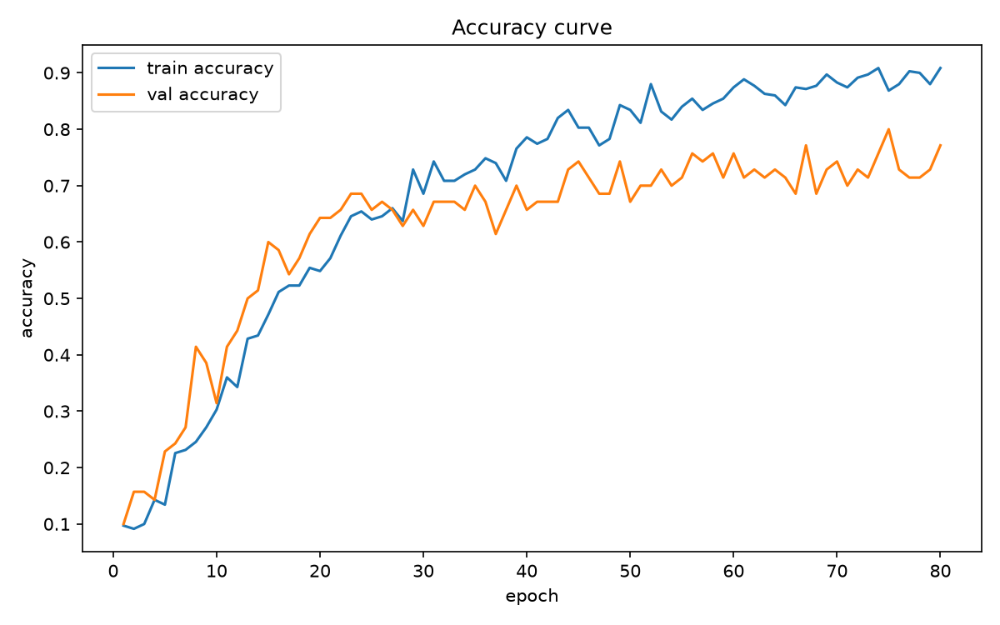
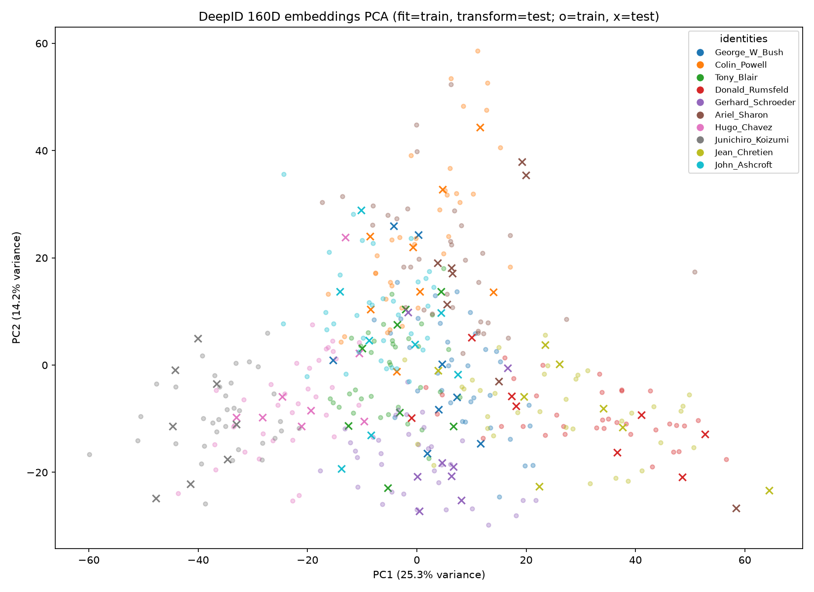

# Mini-DeepID

[](https://github.com/PengjinHao-cell/MiNi-DeepID) [](https://github.com/PengjinHao-cell) [](https://www.python.org/) [](https://pytorch.org/) [](https://developer.nvidia.com/cuda-toolkit) [](https://openaccess.thecvf.com/content_cvpr_2014/html/Sun_Deep_Learning_Face_2014_CVPR_paper.html)

> **An educational reproduction inspired by _Deep Learning Face Representation from Predicting 10,000 Classes_ (CVPR 2014), not a reproduction of the paper's reported 97.45% LFW verification benchmark.**

 [Wiki](../../wiki) · [Original Paper](https://openaccess.thecvf.com/content_cvpr_2014/html/Sun_Deep_Learning_Face_2014_CVPR_paper.html)

Mini-DeepID is a small, reproducible face-representation experiment built on LFW. It preserves three ideas from DeepID—identity-classification supervision, a compact 160-dimensional embedding, and complementary multi-scale features—while reducing the experiment to 10 identities and one lightweight CNN that can be trained on a consumer GPU.

## Results at a glance

| Metric | Result |
| --- | ---: |
| Dataset | LFW, 10 identities × 50 images |
| Frozen split | 350 train / 70 validation / 80 test |
| Random-guess accuracy | 10.00% |
| Best validation accuracy | 80.00% at epoch 75 |
| Final test accuracy | **77.50% (62/80)** |
| Macro Precision / Recall / F1 | 0.7927 / 0.7750 / **0.7758** |
| Embedding dimension | 160 |



This is a **10-class closed-set identification** result. The model cannot reject an unknown identity and must not be interpreted as an access-control or production face-recognition system.

## Method


The input is a grayscale `1×64×64` face. Four convolution blocks produce local-to-global features. Pooled Conv3 and Conv4 maps are concatenated, projected into a 160D embedding, and classified into one of ten known identities.

$$
\mathbf{z}=f_\theta(x)\in\mathbb{R}^{160},\qquad
p(y=k\mid x)=\frac{\exp(o_k)}{\sum_{j=1}^{10}\exp(o_j)}.
$$

Random augmentation is applied only to training data. Validation and test transforms are deterministic.

## Experimental discipline

The project uses gated validation from G0 to G14:

- fixed seed and immutable `split_manifest.csv`;
- real CUDA matrix multiplication and forward/backward checks;
- model-shape and finite-gradient tests;
- a 32-image tiny-set overfit test reaching 100%;
- checkpoint save/resume smoke training;
- validation-only checkpoint selection;
- one final test protected by `final_test_receipt.json`;
- PCA fitted on train embeddings and only transformed on test embeddings.





## Quick start

### Requirements

- Python 3.12
- NVIDIA CUDA-capable GPU
- Validated environment: PyTorch 2.12.1 + CUDA 13.0 on RTX 5060 Laptop GPU

```powershell
python -m venv .venv
& '.\.venv\Scripts\python.exe' -m pip install --upgrade pip
& '.\.venv\Scripts\python.exe' -m pip install -r requirements.txt
```

### Reproduce the pipeline

```powershell
& '.\.venv\Scripts\python.exe' verify_environment.py
& '.\.venv\Scripts\python.exe' prepare_lfw.py
& '.\.venv\Scripts\python.exe' verify_data.py
& '.\.venv\Scripts\python.exe' -m pytest -q
& '.\.venv\Scripts\python.exe' tiny_overfit.py
& '.\.venv\Scripts\python.exe' train.py --epochs 2
```

Formal training is launched by the user from `run_in_pycharm.py`. After the protocol is frozen, `evaluate.py` performs the one-shot final test and refuses to run again when a receipt exists.

## DeepID versus Mini-DeepID

| | Original DeepID | Mini-DeepID |
| --- | --- | --- |
| Scale | about 10,000 identities | 10 LFW identities |
| Architecture | multiple face patches and ConvNets | one four-layer CNN with multi-scale fusion |
| Representation | 160D DeepID | 160D Mini-DeepID |
| Evaluation | LFW verification + Joint Bayesian | closed-set identification |
| Reported number | 97.45% verification | 77.50% identification |

The numbers are not directly comparable because the training data, task, model ensemble, and evaluation protocol differ.

## Repository map

```text
Mini-DeepID/
├── data/manifests/       # frozen split and identity mapping
├── docs/                 # plans, paper, report, and GitHub assets
├── tests/                # model, data, training, and protocol tests
├── wiki/                 # version-controlled Wiki sources
├── model.py              # Mini-DeepID network
├── dataset.py            # manifest-driven data pipeline
├── run_in_pycharm.py     # formal training launcher
├── evaluate.py           # protected one-shot evaluation
└── visualize_embeddings.py
```

Datasets, checkpoints, outputs, and virtual environments are excluded from Git. Running the pipeline regenerates local artifacts.

## Citation

```bibtex
@InProceedings{Sun_2014_CVPR,
  author    = {Sun, Yi and Wang, Xiaogang and Tang, Xiaoou},
  title     = {Deep Learning Face Representation from Predicting 10,000 Classes},
  booktitle = {Proceedings of the IEEE Conference on Computer Vision and Pattern Recognition},
  year      = {2014}
}
```

## Ethics and intended use

This repository is for education and research only. It does not implement unknown-person rejection and must not be deployed for surveillance, access control, identity authentication, or other high-risk decisions.

## License note

The code is provided as an educational project. LFW images and the archived paper remain subject to their original terms and licenses.
