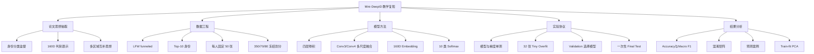
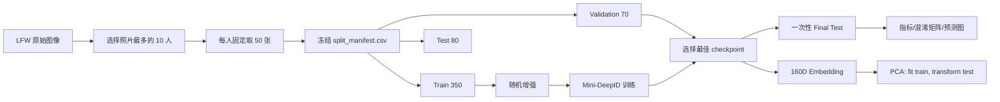

# Mini-DeepID：基于身份分类学习人脸判别表示的教学复现实验

> **实验性质声明：** 本项目受到香港中文大学团队 Sun、Wang 与 Tang 在 CVPR 2014 发表的 DeepID 论文启发，复现其“由身份分类任务学习判别人脸表示”的核心思想。本实验是 LFW 上 10 个身份的 closed-set identification 小规模教学复现，**不是**原论文约 10,000 身份训练系统的完整复现，也**不是**论文所报告 LFW 97.45% verification 结果的复现。

## 摘要

DeepID 提出通过预测大规模身份类别来学习紧凑、具有判别力的人脸表示。本文在单张 RTX 5060 Laptop GPU 上完成一个 Mini-DeepID 教学复现实验：从 Labeled Faces in the Wild（LFW）中自动选择照片数量最多的 10 个身份，每人固定取 50 张灰度人脸，构成共 500 张图像的数据集；采用 350/70/80 的训练、验证、测试固定划分；以四层卷积网络提取多尺度特征，经 160 维隐藏层形成 Mini-DeepID embedding，并使用十分类交叉熵完成闭集身份识别。实验通过环境验证、数据冻结、模型单测、梯度检查、32 张图像过拟合测试、冒烟训练、正式训练和一次性测试等关卡控制实验风险。最终模型在 80 张冻结测试图像上正确识别 62 张，准确率为 **77.50%**，Macro F1 为 **0.7758**，显著高于十分类随机猜测的 10%。结果支持“小规模身份分类监督能够学习具有一定身份判别能力的表示”这一论点，但受身份数量、每类样本数、单一数据来源、闭集协议和简化网络结构限制，不能外推为开放集人脸识别能力。本文最后从数据规模、face patch、多任务/度量学习、预训练、开放集评估及重复实验等方面提出改进方向。

**关键词：** DeepID；人脸识别；卷积神经网络；身份分类；LFW；特征表示；教学复现

---

## 1. 研究背景与实验目的

人脸识别并不只是“把图像分成若干类别”。更核心的问题是：如何把一张人脸压缩为一个低维向量，使同一身份的向量在特征空间中更接近，不同身份的向量更容易区分。DeepID 的关键思想是将大规模身份分类作为代理任务：当神经网络必须从大量身份中做出正确预测时，其隐藏层会被迫保留与身份有关的信息，并抑制部分光照、表情和姿态干扰。

本实验的目的不是追逐原论文指标，而是用可在个人电脑上完整运行的小实验回答三个问题：

1. 身份分类监督能否在 500 张小规模 LFW 数据上学习到超过随机基线的判别能力？
2. 160 维隐藏表示能否形成具有一定类间分离趋势的特征空间？
3. 如何用固定数据协议、分阶段验收和一次性 Final Test，完成一次可追溯的论文思想复现？

本文的主要工作包括：

- 构建 10 个身份、每人 50 张的平衡 LFW 子集；
- 固定 350/70/80 划分并实施 train-only augmentation；
- 实现四层卷积、多尺度融合、160D embedding 的 Mini-DeepID；
- 建立 G0–G14 实验关卡，避免数据、梯度、CUDA 或测试协议错误被正式训练掩盖；
- 从总体指标、逐类指标、混淆矩阵、预测样例和 PCA 分布分析模型效果。

## 2. 原论文简介与复现边界

### 2.1 原论文核心思想

原论文 *Deep Learning Face Representation from Predicting 10,000 Classes* 由 Yi Sun、Xiaogang Wang 和 Xiaoou Tang 提出，发表于 CVPR 2014。工作以约 10,000 个身份的分类任务训练卷积网络，将 160 维隐藏层激活作为 DeepID 特征；同时从多个 face patch 训练多个 ConvNet，使眼睛、鼻子、嘴部和整脸等区域提供互补信息，最终结合 Joint Bayesian 完成 LFW verification。

若输入图像为 $x$，身份标签为 $y$，卷积网络参数为 $\theta$，DeepID 思想可简化表示为：

$$
\mathbf{z}=f_{\theta}(x)\in\mathbb{R}^{160},
\qquad
\hat{\mathbf{p}}=\operatorname{softmax}(W\mathbf{z}+\mathbf{b}),
$$

其中 $\mathbf{z}$ 是紧凑人脸表示。训练通过身份分类损失调整 $\theta$，使 $\mathbf{z}$ 包含足以区分身份的信息。

### 2.2 本实验保留与省略的部分

| 维度 | 原论文 DeepID | 本实验 Mini-DeepID |
| --- | --- | --- |
| 训练身份规模 | 约 10,000 身份 | LFW 10 身份 |
| 任务 | 大规模身份预测，随后 verification | 十分类 closed-set identification |
| 特征维度 | 160D DeepID | 160D Mini-DeepID |
| 图像区域 | 多 face patch、多 ConvNet | 单张整脸、单网络多尺度融合 |
| 后端 | Joint Bayesian | 线性十分类器 |
| 论文指标 | LFW verification 97.45% | 测试集 identification 77.50% |

因此，本文“复现”的严格含义是：保留**分类监督产生判别表示、160D 信息瓶颈和多尺度互补**三项思想，用较低资源验证其基本可行性；不声称复制原系统规模、verification 协议或论文指标。

## 3. 技术方法树与实验流程



实验数据流如下：



## 4. 数据集与实验协议

### 4.1 数据来源与身份定义

实验采用 LFW funneled 灰度版本。程序筛选至少具有 20 张照片的身份，再按照片数量自动选择前 10 人；每个身份最多固定取 50 张。最终身份为 George W. Bush、Colin Powell、Tony Blair、Donald Rumsfeld、Gerhard Schroeder、Ariel Sharon、Hugo Chavez、Junichiro Koizumi、Jean Chretien 和 John Ashcroft。


**图 1　平衡后的十身份样本分布。** 每类均为 50 张，因此总体准确率不会受到类别数量不平衡的直接支配。


**图 2　处理后 LFW 灰度人脸样例。** 图像统一为单通道 $64\times64$，但仍包含姿态、表情和光照差异。

### 4.2 固定划分

每类 50 张图像按照固定随机种子 42 划分：

| 分区 | 每个身份 | 总数 | 用途 |
| --- | ---: | ---: | --- |
| Train | 35 | 350 | 参数学习与数据增强 |
| Validation | 7 | 70 | checkpoint 选择与训练监控 |
| Test | 8 | 80 | 模型冻结后的最终一次评估 |

所有样本及其 `source_index`、身份和分区写入 `data/manifests/split_manifest.csv`。后续程序只能读取该清单，禁止重新调用随机划分。数据增强只作用于 Train，包括概率 0.5 的水平翻转、$\pm8^\circ$ 旋转、最多 5% 平移和 $[0.95,1.05]$ 缩放；Validation 与 Test 只执行确定性的尺寸与归一化处理。

该顺序可以形式化为：

$$
\text{raw samples}\xrightarrow{\text{fixed split}}(D_{tr},D_{va},D_{te}),
\qquad
\mathcal{A}(x)\ \text{仅用于}\ x\in D_{tr}.
$$

这样避免同一原图的增强版本跨越训练集与测试集造成数据泄漏。

## 5. Mini-DeepID 模型方法

### 5.1 网络结构

输入张量形状为 $1\times64\times64$。四个卷积块均使用 $3\times3$ 卷积、ReLU 和 $2\times2$ 最大池化：

| 层 | 输出形状 | 作用 |
| --- | --- | --- |
| Conv1 + ReLU + Pool | $32\times32\times32$ | 提取低层边缘与纹理 |
| Conv2 + ReLU + Pool | $64\times16\times16$ | 组合局部结构 |
| Conv3 + ReLU + Pool | $128\times8\times8$ | 较高层人脸结构 |
| Conv4 + ReLU + Pool | $128\times4\times4$ | 更全局的身份线索 |
| Conv3 自适应池化 | $128\times4\times4$ | 与 Conv4 对齐 |
| 拼接 | $256\times4\times4$ | 多尺度融合 |
| 全连接 + ReLU + Dropout | $160$ | Mini-DeepID embedding |
| 线性分类器 | $10$ | 身份 logits |

模型共有 **897,386** 个可训练参数。设第 $l$ 层卷积输出为：

$$
H^{(l)}=\operatorname{Pool}\left(\operatorname{ReLU}\left(W^{(l)}*H^{(l-1)}+b^{(l)}\right)\right).
$$

Conv3 特征经过自适应池化后与 Conv4 特征拼接：

$$
H_{fusion}=\operatorname{Concat}\left(\operatorname{AAP}_{4\times4}(H^{(3)}),H^{(4)}\right).
$$

最终 160D 表示为：

$$
\mathbf{z}=\operatorname{Dropout}\left(\operatorname{ReLU}(W_e\operatorname{vec}(H_{fusion})+b_e)\right),
\quad \mathbf{z}\in\mathbb{R}^{160}.
$$

### 5.2 分类目标

对于 $K=10$ 个身份，分类概率为：

$$
p(y=k\mid x)=\frac{\exp(o_k)}{\sum_{j=1}^{K}\exp(o_j)},
\qquad \mathbf{o}=W_c\mathbf{z}+\mathbf{b}_c.
$$

使用多类交叉熵优化：

$$
\mathcal{L}_{CE}=-\frac{1}{N}\sum_{i=1}^{N}\log p(y_i\mid x_i).
$$

结合权重衰减后，训练目标可写为：

$$
\min_{\theta}\;\mathcal{L}_{CE}(\theta)+\lambda\lVert\theta\rVert_2^2,
\qquad \lambda=10^{-4}.
$$

## 6. 实验环境与训练策略

### 6.1 硬件与软件环境

| 项目 | 配置 |
| --- | --- |
| 操作系统 | Windows 本地环境 |
| Python | 3.12.10 |
| PyTorch / torchvision | 2.12.1+cu130 / 0.27.1+cu130 |
| CUDA runtime | 13.0 |
| GPU | NVIDIA GeForce RTX 5060 Laptop GPU |
| 显存 | 8151 MiB |
| 随机种子 | 42 |
| 设备策略 | 固定 `cuda:0`，禁止静默 CPU 回退 |

环境验收不仅检查 `torch.cuda.is_available()`，还完成 $2000\times2000$ CUDA 矩阵乘法、有限值检查、模型前向传播、反向传播与梯度有限性检查。

### 6.2 超参数

| 超参数 | 数值 |
| --- | ---: |
| Batch size | 32 |
| 初始学习率 | $10^{-3}$ |
| Weight decay | $10^{-4}$ |
| Dropout | 0.4 |
| 最大 epoch | 80 |
| Early-stopping patience | 12 |
| Embedding 维度 | 160 |

### 6.3 分阶段验收

正式训练前首先进行 32 张训练图像的 Tiny-set Overfit Test。该测试关闭增强、Dropout 和权重衰减，目标不是泛化，而是验证标签、损失、优化器、梯度与模型链路是否能共同工作。模型在第 20 个 epoch 达到 100% 训练准确率，超过 95% 验收阈值。


**图 3　32 张样本的过拟合健康检查。** 达到 100% 表明模型具备拟合能力，但不代表其对未见图像具有 100% 泛化能力。

随后完成两轮冒烟训练，验证 GPU、loss、checkpoint 保存与恢复。正式训练最多运行 80 个 epoch，仅根据 Validation 结果选择 checkpoint；Test 在模型冻结后只运行一次。

## 7. 实验结果

### 7.1 正式训练过程


**图 4　正式训练的 Train/Validation loss。** 训练 loss 总体下降，而验证 loss 在中后期存在波动，提示数据规模较小且出现一定泛化间隙。


**图 5　正式训练的 Train/Validation accuracy。** 最佳验证准确率在 epoch 75 达到 80.00%，最终模型使用该 checkpoint，而不是简单使用 epoch 80 的参数。

### 7.2 总体结果

| 指标 | 结果 |
| --- | ---: |
| 随机猜测 Accuracy | 10.00% |
| Mini-DeepID Test Accuracy | **77.50%（62/80）** |
| Macro Precision | 0.7927 |
| Macro Recall | 0.7750 |
| Macro F1 | **0.7758** |
| 最佳 Validation Accuracy | 80.00%（epoch 75） |

模型比十分类随机基线高 67.5 个百分点，说明它学习到了与身份有关的有效模式。验证准确率 80.00% 与测试准确率 77.50% 接近，未观察到异常巨大的验证—测试落差。不过测试集只有 80 张，每个身份仅 8 张，单张样本就会使总体准确率变化 1.25 个百分点，因此结果应被视为小样本实验观察，而非稳定的人脸识别基准。

### 7.3 混淆矩阵与逐类表现


**图 6　80 张冻结测试图像的混淆矩阵。** 横轴为预测身份，纵轴为真实身份。

| 身份 | Precision | Recall | F1 | 正确数/8 |
| --- | ---: | ---: | ---: | ---: |
| George W. Bush | 0.6667 | 0.7500 | 0.7059 | 6 |
| Colin Powell | 1.0000 | 0.8750 | 0.9333 | 7 |
| Tony Blair | 0.6667 | 0.5000 | 0.5714 | 4 |
| Donald Rumsfeld | 0.7143 | 0.6250 | 0.6667 | 5 |
| Gerhard Schroeder | 0.5455 | 0.7500 | 0.6316 | 6 |
| Ariel Sharon | 0.8571 | 0.7500 | 0.8000 | 6 |
| Hugo Chavez | 1.0000 | 0.7500 | 0.8571 | 6 |
| Junichiro Koizumi | 1.0000 | 1.0000 | 1.0000 | 8 |
| Jean Chretien | 0.7273 | 1.0000 | 0.8421 | 8 |
| John Ashcroft | 0.7500 | 0.7500 | 0.7500 | 6 |

Junichiro Koizumi 与 Jean Chretien 的 8 张测试图像均被正确分类；Tony Blair 的召回率最低，仅正确识别 4 张。Gerhard Schroeder 的召回率为 0.75，但 precision 仅为 0.5455，说明其他身份的图像较容易被错误吸引到该类别。误差并非平均分布，而是集中于若干身份对，这与小样本条件下姿态、光照、年龄变化及身份间视觉相似性有关。

### 7.4 预测样例


**图 7　测试集预测样例。** 绿色标题表示分类正确，红色表示错误；置信度是闭集 softmax 概率，不能解释为陌生人检测可靠度。

Softmax 会强制把每张输入分配给十个已知身份之一。即使输入来自第十一个陌生人，模型仍会给出某个类别及置信度。因此图中的概率只能比较既定十类内部的相对偏好，不能作为实际身份认证阈值。

### 7.5 160D 特征的 PCA 分析


**图 8　Mini-DeepID 160D embedding 的二维 PCA 投影。** PCA 只在 Train embeddings 上拟合，Test embeddings 仅执行 transform；圆点表示 Train，叉号表示 Test。

PCA 图用于观察 160D 表示在二维线性投影中的总体结构。如果同一身份的训练点与测试点在局部区域聚集，同时不同颜色之间存在分隔，则说明身份分类监督形成了一定的类内紧凑与类间区分趋势。需要强调：PCA 只保留二维线性方向，二维重叠不等于原始 160D 空间不可分，二维分离也不能单独证明模型具有开放集识别能力。

## 8. 论点与证据分析

### 论点一：小规模身份分类可以学习非随机的人脸表示

证据是测试准确率从随机基线 10.00% 提升至 77.50%，且 Macro F1 达到 0.7758。由于数据集各类严格平衡，这一结果不能由始终预测多数类获得。该论点在本实验的十身份闭集范围内得到支持。

### 论点二：程序链路具有基本可信度

32 张图像能在 20 个 epoch 内达到 100% 训练准确率，完整测试套件通过，CUDA 前向/反向和梯度检查正常，说明模型没有明显的标签错位、梯度中断或优化器未更新问题。固定 manifest 与 train-only augmentation 降低了划分泄漏风险。

### 论点三：实验支持思想复现，但不支持论文指标复现

Mini-DeepID 与原论文共享身份分类和 160D 表示思想，但训练规模、网络集成、后端任务和评价协议均不同。77.50% closed-set identification 与 97.45% verification 不属于同一指标空间，不能直接比较。实验成功意味着核心机制在小样本情境下可运行，而不是原论文结果被复制。

## 9. 局限性与误差来源

1. **样本规模小。** 只有 500 张图像、80 张测试样本，逐类指标基于 8 张图，统计波动较大。
2. **身份规模小。** 十分类远小于约 10,000 类监督，160D 信息瓶颈承受的区分压力也显著更小。
3. **闭集限制。** 模型假设输入一定属于已知十人，没有 `UNKNOWN` 类和拒识机制。
4. **单一整脸输入。** 未实现原论文的多 patch、多 ConvNet 集成，对局部遮挡、姿态和表情变化的鲁棒性有限。
5. **任务不一致。** 本实验是 identification，未执行标准 LFW pair verification，也未使用 Joint Bayesian。
6. **单次划分。** 固定 seed 保证可复现，但单次划分不能估计不同抽样带来的方差。
7. **从零训练。** 350 张训练图像不足以覆盖复杂人脸变化，容易形成训练—验证泛化间隙。
8. **潜在人口统计偏差。** 自动选择照片最多的 LFW 身份不代表真实世界人口分布，结论不能推广到不同群体。

## 10. 改进方向

### 10.1 近期、低成本改进

- 在不触碰当前 Final Test 的前提下，建立新的重复实验协议，使用多个固定种子或分层交叉验证报告均值与标准差；
- 增加学习率调度与更严格的 early stopping，对比 dropout、weight decay 和增强强度；
- 输出错误样本清单，按姿态、光照、遮挡、表情和模糊程度人工归因；
- 在 Validation 上校准置信度，并明确闭集置信度与真实身份可信度的区别。

### 10.2 方法层改进

- 实现眼睛、鼻子、嘴部和整脸 patch 分支，更接近原论文的多区域互补；
- 使用人脸预训练 backbone，再比较从零训练与迁移学习在小样本下的差异；
- 引入 center loss、contrastive loss、triplet loss 或 ArcFace 类 margin loss，使 embedding 直接优化类内紧凑和类间间隔；
- 对 160D embedding 做余弦相似度与阈值评估，逐步从 closed-set identification 过渡到 verification。

### 10.3 更接近原论文的扩展实验

- 扩大训练身份数量，并将训练身份与 LFW 评估身份隔离；
- 使用标准 LFW pairs 与交叉验证协议报告 verification accuracy、ROC 和 TAR@FAR；
- 增加多 patch、多模型特征拼接，并实现或替代 Joint Bayesian 后端；
- 与简单 CNN、预训练模型和随机特征建立公平 baseline，量化每个 DeepID 设计选择的增益。

所有扩展都应建立**新的实验协议**，不得在看过当前 Test 结果后继续反复调整模型并复用同一测试集，否则当前测试集将逐渐变成隐性验证集。

## 11. 结论

本文完成了一个从论文思想、数据构建、模型实现、GPU 验证、分阶段调试到最终评估的 Mini-DeepID 教学复现。模型以 10 个 LFW 身份、每人 50 张图像进行训练，在冻结的 80 张测试图像上取得 77.50% Accuracy 和 0.7758 Macro F1，显著超过 10% 随机基线。Tiny-set Overfit、固定 manifest、train-only augmentation、Validation 选模、一次性 Final Test 和 train-fit PCA 共同增强了实验的可解释性与可追溯性。

实验说明：即使在远小于原论文规模的条件下，身份分类仍能驱动卷积网络学习具有一定判别能力的 160D 人脸表示。但该结果只适用于十个已知身份的闭集小实验，不能代表原论文 benchmark，更不能用于实际门禁或高风险身份认证。下一步最有价值的方向不是反复优化同一测试集，而是扩大身份规模、引入多区域或度量学习，并采用标准 verification 与开放集协议重新验证。

## 12. 可复现性与产物索引

### 12.1 关键产物

| 产物 | 路径 |
| --- | --- |
| 固定数据清单 | `data/manifests/split_manifest.csv` |
| 身份映射 | `data/manifests/identities.json` |
| 最佳模型 | `checkpoints/mini_deepid_best.pth` |
| 正式训练历史 | `outputs/run_20260825_080302/history.json` |
| 最终指标 | `outputs/metrics.json` |
| Final Test 回执 | `outputs/final_test_receipt.json` |
| 环境报告 | `outputs/environment_report.json` |
| 关卡台账 | `outputs/gate_status.json` |

Final Test 回执记录的 checkpoint SHA256 为：

```text
ca8a57998b3db475d279589c41e6a843ee7839021a2eda19115bb886e61fe569
```

冻结 manifest SHA256 为：

```text
96d37beb9f10d6e35c733e242ec9b4d86b8a47b9f3456a2196a165cb4080f33e
```

### 12.2 主要复现命令

```powershell
& '.\.venv\Scripts\python.exe' verify_environment.py
& '.\.venv\Scripts\python.exe' prepare_lfw.py
& '.\.venv\Scripts\python.exe' verify_data.py
& '.\.venv\Scripts\python.exe' -m pytest -q
& '.\.venv\Scripts\python.exe' tiny_overfit.py
& '.\.venv\Scripts\python.exe' train.py --epochs 2
# 正式训练由用户在 PyCharm 中运行 run_in_pycharm.py
& '.\.venv\Scripts\python.exe' evaluate.py
& '.\.venv\Scripts\python.exe' visualize_embeddings.py
```

`evaluate.py` 在检测到 `outputs/final_test_receipt.json` 后会拒绝再次运行，以保护一次性测试协议。

## 参考文献

[1] Sun Y, Wang X, Tang X. Deep Learning Face Representation from Predicting 10,000 Classes[C]//Proceedings of the IEEE Conference on Computer Vision and Pattern Recognition. 2014.

[2] Huang G B, Ramesh M, Berg T, Learned-Miller E. Labeled Faces in the Wild: A Database for Studying Face Recognition in Unconstrained Environments[R]. University of Massachusetts, Amherst, 2007.

[3] Computer Vision Foundation. CVPR 2014 Open Access: Deep Learning Face Representation from Predicting 10,000 Classes. <https://openaccess.thecvf.com/content_cvpr_2014/html/Sun_Deep_Learning_Face_2014_CVPR_paper.html>.

[4] scikit-learn developers. `fetch_lfw_people` documentation. <https://scikit-learn.org/stable/modules/generated/sklearn.datasets.fetch_lfw_people.html>.

---

**伦理与用途说明：** 本项目仅用于人脸表示学习的教学研究。LFW 是公开研究数据集；本模型不支持陌生人拒识，不应部署于实际身份认证、门禁、监控或其他可能影响个人权益的场景。
